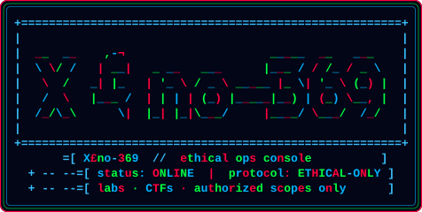

<div align="center">




[](https://git.io/typing-svg)

`STATUS // ONLINE` &nbsp;·&nbsp; `CLEARANCE // STUDENT` &nbsp;·&nbsp; `PROTOCOL // ETHICAL-ONLY`

[](https://discord.gg/3h8K5hyS)
[](https://www.linkedin.com/in/victor-yanfouom-kanfitine-20521935b)
[](https://mastodon.social/@VictorNEWTON)
[](mailto:newtonvictor38@gmail.com)

</div>

---

```
┌─ IDENTITY ───────────────────────────────────────────────────────┐
│  handle     : X£no-369                                           │
│  role       : Computer Science student                           │
│  theater    : ethical hacking · cybersecurity · cryptography     │
│  side quest : physics, systems, and the long hunt for knowledge  │
│  doctrine   : break it to understand it — then help lock it down │
└──────────────────────────────────────────────────────────────────┘
```

I treat security like a craft, not a costume. I live in terminals, read code the way others read maps, and I am building the reflexes of someone who can both **attack (lab-only)** and **defend (for real)**. If you are looking for noise, you are in the wrong bunker. If you are looking for someone who actually wants to learn how systems fail — welcome.

> **Rules of engagement:** labs, CTFs, writeups, and authorized scopes only. Curiosity without consent is not hacking. It is just a crime.

---

### `// CURRENT OPERATIONS`

| Channel | Objective |
| :--- | :--- |
| `TRAINING` | Sharpening pentest fundamentals, Linux internals, and crypto intuition |
| `BUILD` | Small tools and labs in **Python**, **C**, **Pascal**, and shell |
| `SEEKING` | Collabs on open-source security tools and beginner-friendly cyber projects |
| `OPEN TICKET` | Mentorship on advanced pentesting, crypto, and real-world defensive thinking |
| `COMMS` | Ask me about **Kali**, Linux, Python basics, and learning paths in security |

---

### `// ARSENAL`

<div align="center">

<p><strong>live stack</strong></p>

[](https://skillicons.dev)


</div>

---

### `// TELEMETRY`

<div align="center">

[](https://github.com/Xeno-369)
[](https://github.com/Xeno-369)

[](https://github.com/Xeno-369)

[](https://github.com/Xeno-369)

</div>

---

<div align="center">

```
[ X£no-369@bunker ~ ]$ whoami
operator · student · ethical hacker in the making

[ X£no-369@bunker ~ ]$ echo $MOTTO
"Understand the break. Own the fix. Leave the system stronger."

[ X£no-369@bunker ~ ]$ _
```

<sub>No unauthorized access. No gray-area flexing. Just the lab, the logs, and the long game.</sub>

</div>
